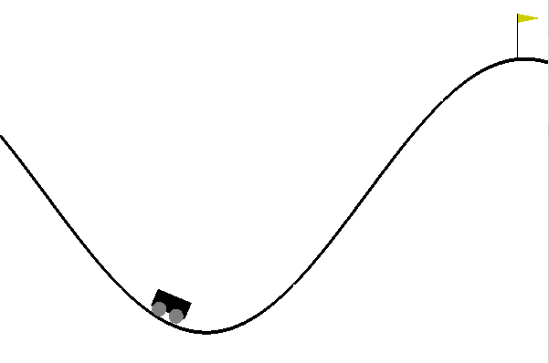

# OpenAI Gym

In this repository OpenAI's Gym is demonstrated in a Jupyter Notebook. The Mountain Car environment is used in which a car has three actions that can change its state. With the use of an appropriate reinforcement algorithm, this environment can be used to train the car to surmount the mountain. 

